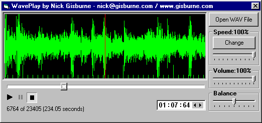



## Accurate waveform display, synched with audio

### Description

Displays an accurate waveform synched with audio, in a scrolling window. I wanted to be able to display a waveform which looked like those in the majority of sound editors (Cool Edit by preference), and this does the job. The waveform moves across the screen in time with the audio and you're able to scroll along the whole length of the waveform. The waveform is 'reasonably' accurate - it would take too long to scan in a multi-meg file and check every byte, so a compromise is used. I don't think the quality of the display suffers at all. This code is part of a bigger project which will not be open-source. Having used a lot of ideas from other coders I thought it only fair to share this much. Limitations: it's only for 44100, 16-bit stereo waveforms, but you should be able to adapt it to 8-bit and other sample rates, etc. I only needed it to play one type of waveform, sorry! Enjoy!
 
### More Info
 

             |
---                |---
**Submitted On**   |2002-06-14 20:51:56
**By**             |[Nick Gisburne](https://github.com/Planet-Source-Code/PSCIndex/blob/master/ByAuthor/nick-gisburne.md)
**Level**          |Intermediate
**User Rating**    |4.3 (43 globes from 10 users)
**Compatibility**  |VB 6\.0
**Category**       |[Sound/MP3](https://github.com/Planet-Source-Code/PSCIndex/blob/master/ByCategory/sound-mp3__1-45.md)
**World**          |[Visual Basic](https://github.com/Planet-Source-Code/PSCIndex/blob/master/ByWorld/visual-basic.md)
**Archive File**   |[Accurate\_w945716142002\.zip](https://github.com/Planet-Source-Code/nick-gisburne-accurate-waveform-display-synched-with-audio__1-35852/archive/master.zip)

